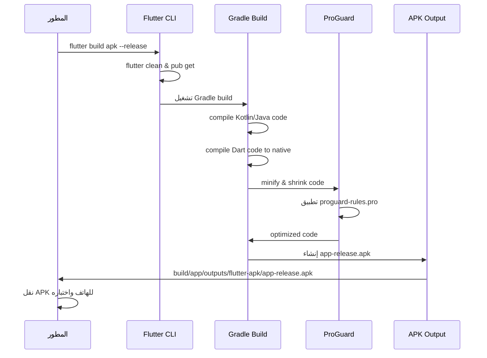

# متتبع الحياة اليومية

تطبيق Flutter لتتبع الحياة اليومية مع إدارة المهام، المشاريع، والإحصائيات.

## نظرة عامة

متتبع الحياة اليومية هو تطبيق شامل يساعد المستخدمين على تنظيم حياتهم اليومية من خلال:
- إدارة المهام والمشاريع
- تتبع الإحصائيات والإنجازات
- نظام الشارات والتحفيز
- واجهة مستخدم عربية احترافية

## التقنيات المستخدمة

- **Flutter**: إطار العمل الرئيسي لواجهة المستخدم
- **Supabase**: قاعدة البيانات والخدمات الخلفية
- **Provider**: إدارة الحالة
- **Google Fonts**: الخطوط العربية
- **Material Design**: تصميم الواجهة

## المتطلبات

- Flutter SDK (3.10.0 أو أحدث)
- Android SDK (minSdk 21, targetSdk 34)
- حساب Supabase مع إعداد المشروع
- جهاز Android أو محاكي للاختبار

## خطوات الإعداد

1. **استنساخ المشروع**
   ```bash
   git clone <repository-url>
   cd daily-life-tracker
   ```

2. **تثبيت الاعتماديات**
   ```bash
   flutter pub get
   ```

3. **إعداد Supabase**
   - إنشاء مشروع جديد في Supabase
   - تحديث ملف `lib/config/supabase_config.dart` مع بيانات المشروع:
   ```dart
   const supabaseUrl = 'YOUR_SUPABASE_URL';
   const supabaseAnonKey = 'YOUR_SUPABASE_ANON_KEY';
   ```

4. **تشغيل التطبيق**
   ```bash
   flutter run
   ```

## بناء APK للتجربة

### Debug APK
```bash
flutter build apk --debug
```
- **الموقع**: `build/app/outputs/flutter-apk/app-debug.apk`
- **الحجم**: أكبر، يحتوي على debugging symbols
- **الاستخدام**: للتطوير والاختبار فقط

### Release APK
```bash
flutter build apk --release
```
- **الموقع**: `build/app/outputs/flutter-apk/app-release.apk`
- **الحجم**: أصغر، محسّن للأداء
- **المميزات**: يستخدم ProGuard لتقليل الحجم وتحسين الأداء

### Split APKs (حسب Architecture)
```bash
flutter build apk --split-per-abi
```
- **النتائج**: ملفات منفصلة لكل معمارية:
  - `app-arm64-v8a-release.apk`
  - `app-armeabi-v7a-release.apk`
  - `app-x86_64-release.apk`
- **الميزة**: حجم أصغر لكل ملف (~20-30 MB بدلاً من ~50-60 MB)

## تثبيت APK على الهاتف

### الطريقة 1: عبر USB
1. تفعيل "Unknown Sources" في إعدادات الهاتف
2. نسخ ملف APK إلى الهاتف
3. فتح الملف والموافقة على التثبيت

### الطريقة 2: عبر ADB
```bash
adb install build/app/outputs/flutter-apk/app-release.apk
```
لإعادة التثبيت:
```bash
adb install -r build/app/outputs/flutter-apk/app-release.apk
```

### الطريقة 3: عبر Cloud Services
1. رفع ملف APK على Google Drive أو أي خدمة تخزين
2. مشاركة الرابط وتحميله على الهاتف
3. تثبيت الملف من المتصفح

## اختبار التطبيق

### قبل الاختبار
- التأكد من اتصال الإنترنت
- التحقق من إعدادات Supabase
- تفعيل التصاريح المطلوبة (Internet, Network State)

### قائمة الاختبار
- [ ] تسجيل الدخول/التسجيل
- [ ] إضافة المهام والمشاريع
- [ ] تحديث وحذف المهام
- [ ] عرض الإحصائيات
- [ ] فتح الشارات والإنجازات
- [ ] تغيير إعدادات الملف الشخصي
- [ ] العمل بدون اتصال (إذا مدعوم)

## استكشاف الأخطاء

### مشاكل الاتصال بـ Supabase
```bash
# التحقق من credentials
flutter run --debug
# عرض logs
adb logcat | grep flutter
```

### أخطاء ProGuard
- مراجعة ملف `android/app/proguard-rules.pro`
- التحقق من قواعد الحفظ للكلاسات المهمة
- إعادة البناء: `flutter clean && flutter build apk --release`

### مشاكل البناء
```bash
# تنظيف وإعادة البناء
flutter clean
flutter pub get
flutter doctor
```

### حجم APK كبير
- استخدام `--split-per-abi` للبناء
- مراجعة الـ assets غير المستخدمة
- تحليل الحجم: `flutter build apk --release --analyze-size`

## مخطط عملية البناء



## ملاحظات إضافية

### تحسين حجم APK
- **Split APKs**: استخدم `--split-per-abi` لتقليل الحجم
- **Asset Optimization**: ضغط الصور والملفات
- **Tree Shaking**: إزالة الكود غير المستخدم

### Signing للإصدار النهائي
للنشر على Play Store، ستحتاج لإنشاء keystore:
```bash
keytool -genkey -v -keystore ~/upload-keystore.jks -keyalg RSA -keysize 2048 -validity 10000 -alias upload
```

إنشاء `android/key.properties`:
```properties
storePassword=<password>
keyPassword=<password>
keyAlias=upload
storeFile=<path-to-keystore>
```

### اختبار الأداء
- تحليل حجم APK: `flutter build apk --release --analyze-size`
- مراجعة الـ dependencies الكبيرة
- التأكد من تحسين الصور والـ assets

## هيكل المشروع

```
lib/
├── config/           # إعدادات التطبيق
├── models/           # نماذج البيانات
├── providers/        # إدارة الحالة
├── screens/          # شاشات التطبيق
└── main.dart         # نقطة البداية

android/
├── app/
│   ├── build.gradle.kts    # إعدادات البناء
│   ├── proguard-rules.pro # قواعد ProGuard
│   └── src/main/
│       ├── AndroidManifest.xml
│       └── res/values/strings.xml
└── ...

assets/
├── images/           # الصور
├── icons/            # الأيقونات
└── fonts/            # الخطوط
```

## الدعم

لأي استفسارات أو مشاكل، يرجى التواصل عبر:
- إنشاء Issue في GitHub
- مراجعة وثائق Flutter الرسمية
- التحقق من وثائق Supabase
